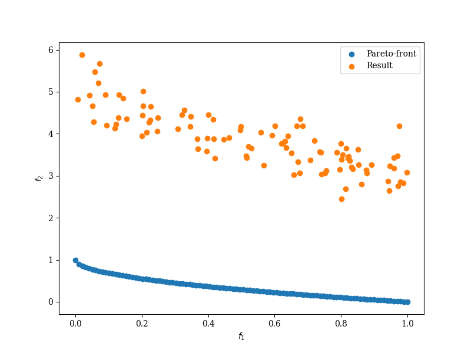

# Metaheuristic Implementations #

Implementation of various metaheuristics using Python. Not all may be completed, so double check before using.

Requirements are listed in the requirements.txt file.

## CMODE ##

A cooperative multi-objective differential evolution algorithm, as explained in:

[Wang, Jiahai, Weiwei Zhang, and Jun Zhang.
"Cooperative differential evolution with multiple populations for multiobjective optimization."
IEEE Transactions on Cybernetics 46.12 (2015): 2848-2861.](https://www.doi.org/10.1109/TCYB.2015.2490669)

Note: improvements might still be made around the storage of solutions within the archive.

## MOPSO ##

A multi-objective particle swarm optimizer, as explained in:

[Coello, CA Coello, and Maximino Salazar Lechuga. "MOPSO: A proposal for multiple objective particle swarm optimization." Proceedings of the 2002 Congress on Evolutionary Computation. CEC'02 (Cat. No. 02TH8600). Vol. 2. IEEE, 2002.](https://doi.org/10.1109/CEC.2002.1004388)

## CMOPSO (INCOMPLETE) ##

An attempted implementation of a competitive multi-objective particle swarm optimizer, as explained in:

[Zhang, Xingyi, et al. 
"A competitive mechanism based multi-objective particle swarm optimizer with fast convergence." 
Information Sciences 427 (2018): 63-76.](https://doi.org/10.1016/j.ins.2017.10.037)

The paper itself is vague on the implementation of the polynomial mutation operator. Several papers are listed,
each of which has a different mutation, making it difficult to determine the correct one. After testing with PyMoo
it doesn't appear like I've done this correctly. Results express the population has a similar shape of pareto front
to the known optimal, but is far from it.

[PlatEMO](https://github.com/BIMK/PlatEMO) has their CMOPSO working, and I attempted to copy it, but cannot receive the results that they get.

